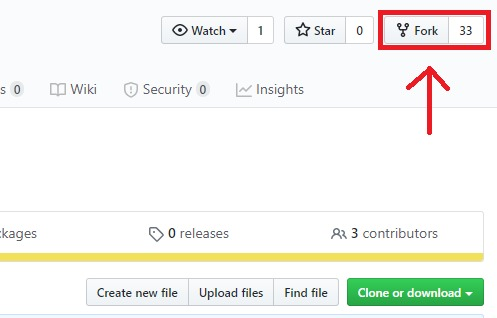
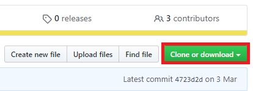
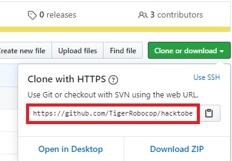
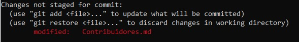
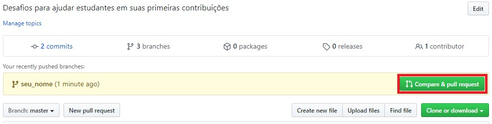
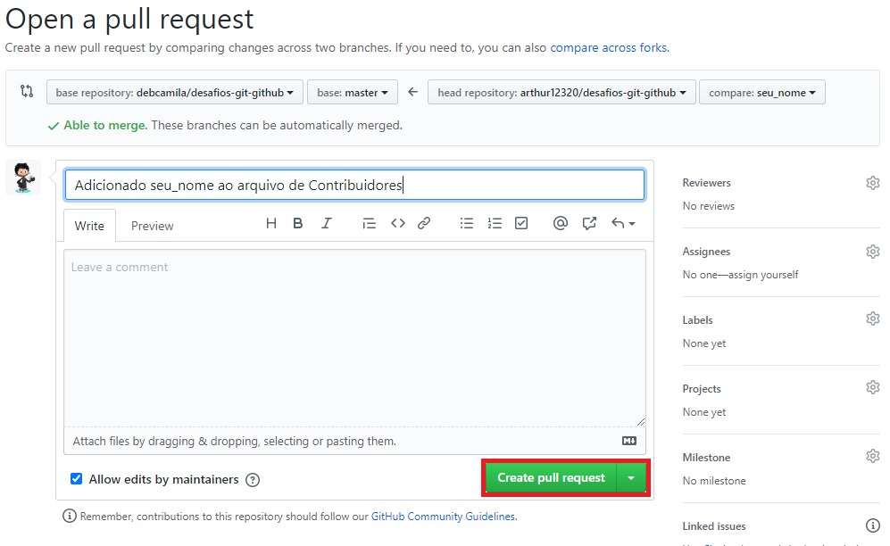

### Inspirado em: https://github.com/AliceWonderland/hacktoberfest e https://github.com/firstcontributions/first-contributions

# Como contribuir com esse projeto?



## Fork esse repositório

Fork esse repositório clicando no botão de _Fork_ no topo dessa página. Isso vai criar uma cópia desse repositório na sua conta.

## Clone esse repositório



Agora clone o repositório que foi forkado na sua máquina. Vá para sua conta do GitHub ou abra o repositório forkado e clique no botão _Clone or download_ e então clique na opção _https_ e copie a url

Abra o seu terminal e rode o comando ```git clone "url que você copiou"```



Exemplo: ```git clone https://github.com/debcamila/desafios-git-github.git``` 

## Atualize o repositório

Agora que você clonou o repositório, você tem que se certificar que seu repositório está o mais atualizado possivel, para isso entre no seu terminal e rode o comando: ```git pull origin master```


## Crie uma nova branch
Vá para o repositório na sua máquina (se você não estiver lá):

```cd desafios-git-github```

Crie uma nova branch usando o comando:

```git checkout -b nome_da_sua_branch```

Exemplo: ```git checkout -b deborah_camila```

## Faça as modificações necessárias e adicione elas a um commit
Agora abra o arquivo ```Contribuidores.md``` em um editor de texto, adicione seu nome seguindo o exemplo abaixo: 

```markdown
#### Nome: SEU NOME
- Lugar: Cidade, Estado, País
- Formação: Curso, período
- GitHub: [seu nome no GitHub](link do seu GitHub)
```



## Faça push nas modificações para o GitHub
Adicione, commite e dê push nas suas modificações

```sh
git add .
git commit -m 'Adicionado <seu-nome> para a lista de contribuidores'
git push origin nome_da_sua_branch
```

## Envie suas modificações para revisão

Se agora você voltar ao seu repositório no GitHub você verá um botão de _Compare & pull request_. Clique nesse botão.



Agora envie seu _pull request_



Em breve adicionaremos todas as suas modificações dentro da branch _master_ desse projeto. Você vai receber uma notificação no seu e-mail quando as mudanças forem adicionadas.

## Parabéns :sparkles:
Você conseguiu contribuir em seu primeiro projeto Open Source. Existem vários projetos como esse espalhados pelo GitHub quer descobrir mais sobre eles? Dá uma olhada nesses links aqui:
- [Lista Maravilhosa de Projetos Open-Source](https://github.com/camilatigre/listamaravilhosaopensource)
- [Divertidalista](github.com/training-center/divertidalista)
- [Guia: Como contribuir em Open Source](https://willianjusten.com.br/guia-como-contribuir-em-open-source/)
